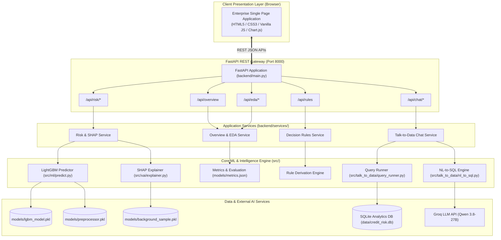

# NeoStats AI-Powered Credit Risk Intelligence Platform

> **Enterprise-grade credit scoring, explainable underwriting (SHAP), automated policy rule derivation, and natural-language portfolio analysis powered by FastAPI, LightGBM, and Groq LLM.**

[](https://www.python.org/)
[](https://fastapi.tiangolo.com/)
[](https://developer.mozilla.org/)
[](https://www.chartjs.org/)
[](https://lightgbm.readthedocs.io/)
[](https://shap.readthedocs.io/)
[](https://groq.com/)
[-orange.svg)](https://github.com/astral-sh/uv)
[](https://www.docker.com/)

---

## 1. Executive Summary & Architecture

The **NeoStats Credit Risk Intelligence Platform** is a full-stack, enterprise-grade risk assessment and analytics system built for bank underwriting teams, risk committees, and credit analysts. Designed upon the Home Credit Default Risk benchmark, it replaces prototype-style interfaces with a decoupled, high-performance architecture:

- **Decoupled Architecture:** High-speed **FastAPI** REST backend serving an enterprise **HTML5 / CSS3 / Vanilla JavaScript** Single Page Application with dynamic **Chart.js** telemetry.
- **Early Default Detection:** LightGBM Gradient Boosted Decision Tree optimized for severe class imbalance (~8% default rate) using cost-sensitive gradient weighting (`scale_pos_weight = 11.5`) and PR-AUC optimization.
- **Explainable Underwriting (XAI):** `shap.TreeExplainer` decomposes predictions into individual risk-increasing vs. risk-reducing feature attributions with adverse action narratives.
- **Automated Rule Derivation:** Translates dominant SHAP feature drivers and validated risk thresholds into auditable, model-informed credit policy rules for underwriting committees.
- **Conversational Talk-to-Data:** Natural-language portfolio querying powered by **Groq Ultra-Fast Inference** (Qwen 3.8-27B), with strict SQL injection/mutation guardrails and executive business summaries.

### Architecture Diagram



---

## 2. Quick Start & Setup Instructions

### Prerequisites
- **Python 3.11** installed
- **uv** (ultra-fast Rust package manager) or standard `pip`
- **Groq API Key** (for conversational Talk-to-Data)

### Option A: Running with `uv` (Recommended)
```bash
# 1. Clone repository and navigate to platform folder
cd credit_risk_platform

# 2. Copy environment template and configure Groq API key
cp .env.example .env
# Edit .env and verify GROQ_API_KEY=gsk_...

# 3. Synchronize environment and install dependencies in seconds
uv sync

# 4. Launch the Enterprise Web Application
uv run uvicorn backend.main:app --host 0.0.0.0 --port 8000
```
Open **`http://localhost:8000`** in your browser to access the enterprise HTML/CSS/JavaScript platform.

> **Legacy Streamlit Interface:** The original prototype interface is preserved and can be started in parallel via:
> ```bash
> uv run streamlit run app/main.py --server.port 8501
> ```
> The Streamlit app is a legacy/prototype interface. The Dockerized application serves the `frontend/` HTML/CSS/JavaScript client through FastAPI.

---

### Option B: One-Command Dockerized Deployment
```bash
# Build and launch containerized application
docker compose up --build
```
Access the application at **`http://localhost:8000`**. The container includes a Docker healthcheck pointing to `/api/health`.

---

## 3. Project Directory Structure

```text
credit_risk_platform/
├── backend/                            # FastAPI REST API & Service Layer
│   ├── main.py                         # Application entrypoint & static mount
│   ├── api/routes/                     # Modular route handlers
│   │   ├── overview.py                 # KPI & portfolio summary endpoints
│   │   ├── eda.py                      # 5 business insights, feature taxonomies, DQ
│   │   ├── risk.py                     # Real-time scoring, presets, SHAP attributions
│   │   ├── rules.py                    # Credit policy rules & methodology
│   │   └── chat.py                     # NL-to-SQL execution & validation
│   └── services/                       # Business logic singletons
│       ├── risk_service.py             # Model inference, score scaling, SHAP parsing
│       ├── eda_service.py              # Insights data, categories, quality metrics
│       ├── rules_service.py            # Credit rules repository & filters
│       └── chat_service.py             # Query runner & safety enforcement
├── frontend/                           # Enterprise Client (Pure HTML5 / CSS3 / ES6+)
│   ├── index.html                      # Single Page Application shell & layout
│   ├── css/
│   │   ├── main.css                    # Design tokens, theme variables, base layout
│   │   └── components.css              # Cards, metrics, tables, forms, chat, badges
│   ├── js/
│   │   ├── app.js                      # Application controller & SPA hash router
│   │   ├── api.js                      # Centralized fetch wrapper & error handling
│   │   ├── charts.js                   # Chart.js renderers with dark enterprise theme
│   │   └── pages/                      # Page controllers
│   │       ├── overview.js             # Overview dashboard & KPI row
│   │       ├── eda.js                  # EDA tabs, Chart.js views, quality table
│   │       ├── risk.js                 # Applicant form, gauge meter, SHAP bars
│   │       ├── rules.js                # Policy engine, filter pills, methodology
│   │       └── chat.js                 # Chat timeline, query runner, SQL expander
│   └── assets/                         # SVG icons, logo, favicon
├── src/                                # Core Machine Learning & Data Pipeline
│   ├── data/
│   │   ├── loader.py                   # 3-table aggregator (app + bureau + prev)
│   │   └── preprocessor.py             # Feature engineering, imputation & encoders
│   ├── ml/
│   │   ├── train.py                    # 5-fold CV LightGBM training pipeline
│   │   ├── predict.py                  # Real-time inference & risk tiering
│   │   └── evaluate.py                 # Diagnostic curves (ROC, PR, Confusion Matrix)
│   ├── talk_to_data/
│   │   ├── nl_to_sql.py                # NL-to-SQL with Groq LLM & validation
│   │   ├── query_runner.py             # SQLite query execution & narrative insights
│   │   └── prompt_templates.py         # Versioned prompts & few-shot schema
│   ├── xai/
│   │   └── explainer.py                # SHAP waterfall, beeswarm & rule extraction
│   └── utils/
│       ├── logger.py                   # Structured logging setup
│       ├── config.py                   # Centralized configuration constants
│       └── helpers.py                  # Database initialization & utilities
├── app/                                # Legacy Streamlit UI (preserved)
│   ├── main.py
│   └── pages/
├── data/                               # Mounted dataset storage & SQLite DB
├── models/                             # LightGBM, preprocessor, SHAP sample, metrics
├── Dockerfile                          # Multi-stage production container
├── docker-compose.yml                  # Container orchestration
├── pyproject.toml                      # uv package manifest
├── requirements.txt                    # Compiled pip-compatible dependency lockfile
├── .env.example                        # Configuration template
└── README.md                           # Master documentation
```

---

## 4. API Endpoints Specification

| Method | Endpoint | Description | Response Model / Payload |
|---|---|---|---|
| `GET` | `/api/health` | Service healthcheck and uptime probe | `{"status": "online", "platform": ...}` |
| `GET` | `/api/overview` | KPI row metrics, portfolio breakdown, summary insights | Real ROC-AUC, PR-AUC, 144 features, risk bands |
| `GET` | `/api/eda/insights` | 5 verified business findings with Chart.js configurations | JSON dataset with labels, rates, relative metrics |
| `GET` | `/api/eda/categories`| 4 banking domain feature taxonomies | Financial, Bureau, Behavioral, Demographic |
| `GET` | `/api/eda/data-quality` | Missing-value rates, imputation strategy, data integrity | Clean table of columns, missing %, types |
| `GET` | `/api/eda/portfolio` | Macro portfolio aggregates and default rates | Aggregate statistics for portfolio overview |
| `GET` | `/api/risk/presets` | Pre-configured applicant archetypes (Prime, Borderline, Subprime) | Full feature dictionaries for form population |
| `GET` | `/api/risk/samples` | Curated sample historical applicant IDs with ground truth | Array of `{"sk_id_curr", "label", "ground_truth"}` |
| `GET` | `/api/risk/lookup/{sk_id}` | Direct SQLite database lookup by historical applicant ID | Complete applicant record with ground truth default status |
| `POST` | `/api/risk/predict` | Real-time LightGBM inference, score scaling, risk band | `default_probability`, `credit_score`, `risk_band`, `decision` |
| `POST` | `/api/risk/predict` | Computes risk prediction, local SHAP attributions, and AI explanation | `risk_reducing_factors`, `risk_increasing_factors`, `ai_explanation` |
| `GET` | `/api/rules` | ML-derived credit policy rules with optional filter `?risk=all\|high\|low` | Array of rules with conditions, rationale, actions |
| `GET` | `/api/chat/samples` | Curated sample queries for portfolio exploration | Array of 4 recommended NL questions |
| `POST` | `/api/chat` | Natural language question to SQL execution and LLM response | `{"query": "..."}` -> `answer`, `sql`, `columns`, `rows` |

---

## 5. Machine Learning Design & Class Imbalance Strategy

### Model Selection Rationale
Credit default risk data is predominantly tabular, heterogeneous, and subject to non-linear interaction thresholds and informative missing values. **LightGBM Gradient Boosted Decision Trees** were selected for:
1. **Tree-Structured Gradient Boosting:** Naturally captures multi-way interactions (e.g., leverage vs. age vs. external bureau scores).
2. **Native Missing Value Branching:** Treats missingness as informative rather than distorting variance via artificial imputations.
3. **Sub-Millisecond Latency:** In-memory inference takes under 5 milliseconds per record, ensuring instant response in high-volume underwriting portals.

### Class Imbalance Strategy
The dataset exhibits an extreme **11.5 : 1** negative-to-positive ratio (~8.07% default rate). Conventional accuracy is misleading because a naive model predicting 0 achieves 92% accuracy while missing 100% of defaults.
- **Cost-Sensitive Weighting:** Configured `scale_pos_weight = 11.5` in the gradient loss function, penalizing false negatives proportionally to empirical class frequency.
- **Primary Optimization Metric:** **PR-AUC (Precision-Recall Area Under Curve / Average Precision)**. Unlike ROC-AUC which can be artificially inflated by large true-negative cohorts, PR-AUC strictly tracks precision-recall trade-offs on the minority default class.
- **Stratified 5-Fold Cross-Validation:** Guarantees uniform default proportions across all training and evaluation folds.

### Model Performance Metrics (Preserved from Model Artifacts)
| Metric | 5-Fold CV Mean | Holdout Test Set | Baseline / Benchmark |
|---|---|---|---|
| **ROC-AUC** | **0.730** | **0.728** | 0.500 (Random Guess) |
| **PR-AUC** | **0.226** | **0.233** | 0.081 (No-Skill Baseline) |
| **Engineered Features** | 144 | 144 | 122 (Raw Dataset) |
| **Optimal F1 Threshold** | 0.385 | 0.385 | Standard 0.500 |

---

## 6. Explainable AI (XAI) & Credit Decision Rules

### SHAP Explanatory Framework
Using `shap.TreeExplainer`, the platform computes exact Shapley values derived from cooperative game theory:
- **Global Feature Attributions:** Highlights overarching portfolio drivers: `EXT_SOURCE_2`, `EXT_SOURCE_3`, `CREDIT_INCOME_RATIO`, and `DAYS_EMPLOYED` dominate default risk.
- **Local Waterfall Attributions:** Decomposes an applicant's raw log-odds score into positive (risk-increasing) and negative (risk-reducing) contributions, generating compliant **Adverse Action Reasons**.

### Credit Policy Rules (`MODEL → SHAP → POLICY`)
The platform bridges black-box ML and underwriting policy via a 5-step derivation pipeline, segmenting underwriting boundaries into three distinct risk tiers:
1. **Rule CR-01 (High Risk):** `IF EXT_SOURCE_2 < 0.35 AND CREDIT_INCOME_RATIO > 3.2 → HIGH RISK (Confidence: 82.4%)`  
   *Business Rationale:* Weak external credit bureau score combined with excessive debt relative to annual income.  
   *Underwriting Action:* Mandatory credit committee review; require guarantor or lower credit limit.
2. **Rule CR-02 (High Risk):** `IF PREV_APP_REFUSED_RATE > 0.40 AND BUREAU_ACTIVE_LOANS >= 3 → HIGH RISK (Confidence: 77.1%)`  
   *Business Rationale:* History of frequent rejections coupled with active multi-lender debt obligations.  
   *Underwriting Action:* Decline automated approval; inspect past multi-lender delinquency.
3. **Rule CR-03 (High Risk):** `IF DAYS_EMPLOYED < 365 AND ANNUITY_INCOME_RATIO > 0.30 → HIGH RISK (Confidence: 74.8%)`  
   *Business Rationale:* Short employment tenure paired with severe monthly installment debt burden.  
   *Underwriting Action:* Short tenure with heavy installment ratio requires payroll deduction guarantee.
4. **Rule CR-04 (Medium Risk):** `IF EXT_SOURCE_2 BETWEEN 0.35 AND 0.55 AND ANNUITY_INCOME_RATIO BETWEEN 0.18 AND 0.28 → MEDIUM RISK (Confidence: 78.4%)`  
   *Business Rationale:* Borderline credit bureau rating paired with intermediate installment burden near debt service threshold.  
   *Underwriting Action:* Secondary underwriting review; mandate 3-month bank statement verification and payroll direct debit.
5. **Rule CR-05 (Medium Risk):** `IF BUREAU_ACTIVE_LOANS >= 2 AND DAYS_EMPLOYED BETWEEN 365 AND 1095 → MEDIUM RISK (Confidence: 75.6%)`  
   *Business Rationale:* Multiple active credit lines with developing employment tenure (1 to 3 years).  
   *Underwriting Action:* Cap Loan-to-Value (LTV) at 75%; restrict maximum loan tenor to 36 months.
6. **Rule CR-06 (Low Risk):** `IF EXT_SOURCES_MEAN > 0.65 AND PAYMENT_RATE < 0.06 → LOW RISK (Confidence: 93.2%)`  
   *Business Rationale:* Superior bureau scores combined with highly manageable monthly repayment terms.  
   *Underwriting Action:* Fast-track automated sanction with preferential prime interest margin.
7. **Rule CR-07 (Low Risk):** `IF GOODS_PRICE_CREDIT_RATIO >= 1.0 AND EMPLOYED_TO_AGE_RATIO > 0.20 → LOW RISK (Confidence: 89.6%)`  
   *Business Rationale:* Fully asset-backed loan combined with mature, stable employment longevity.  
   *Underwriting Action:* Standard approval workflow; enforce baseline document requirements.

---

## 7. Talk-to-Data (NL-to-SQL) & Hallucination Guardrails

The conversational interface uses **Groq Ultra-Fast Inference** (`qwen/qwen3.8-27b`) paired with an SQLite analytics database:
1. **Schema Awareness & Few-Shot Prompting:** Injects explicit column definitions, data types, and primary-foreign key relationships (`applications.SK_ID_CURR = bureau.SK_ID_CURR`) with five representative query patterns.
2. **Destructive Mutation Blocker:** Strict regex and syntax validation reject any query attempting `DROP`, `DELETE`, `UPDATE`, `INSERT`, `ALTER`, or schema modifications.
3. **Automatic Safety Limits:** Adds `LIMIT 100` to unconstrained queries and rejects explicit limits above `500`.
4. **Hallucination Guard:** Rejects multiple statements and validates generated SQL with SQLite's query planner against the known database schema before execution. Invalid queries return a controlled error instead of fabricated answers.
5. **Controlled SQL Expander & Dynamic Auto-Charts:** Evaluators can inspect the generated SQL query and raw result table via a toggleable drawer. Tabular results with numerical dimensions are automatically rendered as interactive Chart.js bar charts (with adaptive green/amber/red risk color coding) directly within the conversation stream.

### Direct Historical Applicant Lookup (Ground Truth Benchmark)

On the **Risk Scoring & Decisioning** page, underwriters are not limited to synthetic archetype presets:
- Direct search bar allows querying any historical applicant by `SK_ID_CURR` (e.g. `100002`, `100003`, `100031`) directly from the SQLite database.
- Auto-populates all 144 underwriting dimensions into the scoring pipeline.
- Automatically compares the model's predicted risk score and underwriting decision (`APPROVED`, `REVIEW`, `DECLINED`) against the actual historical ground-truth outcome (`TARGET = 1` Default vs `TARGET = 0` Repaid).

### Prompt and Token Strategy

- The schema summary and five few-shot examples are centralized in `src/talk_to_data/prompt_templates.py`.
- SQL generation uses temperature `0.0` and a `600` token response cap to keep SQL deterministic and compact.
- Conversation context is limited to the last six turns.
- Narrative generation previews at most 15 result rows and uses a `400` token response cap.

### Verified Talk-to-Data Examples

These five questions were run through Groq, SQLite, and the narrative summarizer. Each returned generated SQL and database rows; the first four also produced an executive narrative after a transient Groq rate-limit retry:

| Question | Result |
|---|---|
| What is the default rate by income type? | 8 grouped rows with default-rate percentages |
| Average loan amount by occupation type? | 18 occupation groups with average credit and income |
| Top 10 riskiest occupations by default rate? | 10 ranked occupation rows |
| Show clients with external source score below 0.3 | 100 applicant rows, capped by safety limit |
| What is the distribution of credit versus annuity amounts across contract types? | 2 contract-type aggregate rows |

The UI exposes the generated SQL, result table, and executive takeaway for successful queries. Invalid schema references are rejected before execution.

### Known Limitations and Improvements

- Talk-to-Data requires `GROQ_API_KEY`; without it, SQL generation and narrative responses return a controlled configuration error.
- The risk form exposes a curated applicant schema rather than every raw Home Credit field.
- The current rules are model-informed business rules maintained in the explainability module; production governance would require versioned policy approval and monitoring.
- Future improvements include automated schema-aware query repair, model calibration monitoring, fairness evaluation by cohort, and browser-based end-to-end tests.

---

## 8. Enterprise Frontend Design System

The presentation layer was engineered from first principles using modern, lightweight web standards:
- **Color Palette:** Deep charcoal/navy background (`#080c14` / `#0d131f` / `#131d2f`), NeoStats emerald accent (`#10b981`), electric cobalt (`#3b82f6`), and semantic risk colors (green for low risk, amber for medium risk, crimson for high risk).
- **Zero Emojis:** Replaced all informal emojis with high-resolution Lucide-style SVG vector icons and structured typography badges.
- **Zero Inline Code Bleed:** Eliminated unintended script injection artifacts from the UI.
- **Dynamic Charting:** Integrated Chart.js v4 with custom dark mode tooltips, smooth bezier curves, and gridline styling.
- **Responsive Layout:** CSS Grid and Flexbox layout adapts seamlessly across 1440px+ ultra-wide displays, 1024px laptops, and tablet breakpoints.

---

## 9. Verification & Testing Summary

Run the focused checks with:

```bash
uv run python -m unittest discover -s tests -v
```

The checks cover SQL safety, API health and core route responses, risk prediction fields, and risk-band boundaries. For a clean clone, Docker is the supported runtime:

```bash
docker compose up --build
```

The Compose file uses the checked-in `.env.example` template, so a private `.env` file is not required to start the application. Talk-to-Data remains unavailable until a real Groq key is supplied.

### Clean-Clone Data Setup

Raw Home Credit CSV files and the generated SQLite database are intentionally excluded from Git. Before using EDA or Talk-to-Data after a fresh clone, download the Home Credit Default Risk files from Kaggle and place them in `data/` (or keep the Kaggle folder beside `credit_risk_platform/`). The required files are `application_train.csv`, `bureau.csv`, and `previous_application.csv`. The application creates `data/credit_risk.db` automatically when it is absent.

1. **FastAPI Health & Routing:** The test suite covers `/api/health`, `/api/overview`, `/api/eda/insights`, `/api/risk/presets`, `/api/rules`, and `/api/chat/samples`.
2. **ML Inference & SHAP:** Real-time evaluation of high-risk subprime applicants returned exact LightGBM probability (81.67%), scaled credit score (400 / 850), DECLINED decision, and divergent risk factor bars.
3. **Talk-to-Data NL-to-SQL:** Executed natural language queries via Groq LLM; verified SQL generation, SQLite execution, result table formatting, and executive AI summary. Tested safety blockers against destructive queries (`DROP TABLE`).
4. **Visual QA:** Verified typography, contrast, layout stability, and responsiveness across all 5 primary views via headless browser recording and screenshots.
